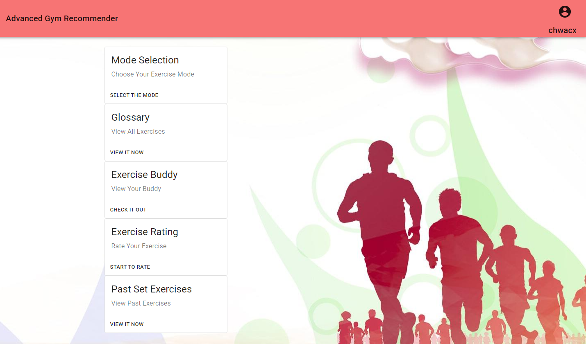

## SECTION 1 : PROJECT TITLE
## Advanced Gym Recommender

---

## SECTION 2 : EXECUTIVE SUMMARY / PAPER ABSTRACT
Exercise is undeniably an important aspect in our lives due to the countless benefits it brings such as reduction in chronic health issues, improvement in muscle strength and boosting our mental well-being. However, adopting an exercise routine may prove challenging to many as they do not possess adequate knowledge on the physical anatomy of the body and proper selection of exercises to meet their fitness goals. Engaging gym trainers may also not be a cost-effective solution due to the need to conduct dedicated personalisation for each individual. On the other hand, gym trainers may face difficulty in managing the requirements and schedules of their clients, and to design innovative exercise routines for them. With these challenges in mind, our team has designed an intelligent cognitive reasoning system, Advanced Gym Recommender (AGR), to enhance the exercise experience of our potential users.

Acquisition of exercise knowledge was conducted via data mining and manual elicitation, to extract key information and insight of our targeted fitness domain. The knowledge was represented in the form of rules, and was further incorporated into a flowchart model. A hybrid-reasoning system was developed to provide exercise recommendations at different stages of user experience. For the first pass recommendation, feature discovery was done via bag-of-words approach and cosine similarity was applied to the user’s implicit preferences. In subsequent recommendations, a model based collaborative filtering algorithm was implemented to extract user and item latent features, and the top set of predicted item scores was recommended to the user. Using the derived user latent features, similar profiles of users could be constructed and recommended as exercise companions to motivate users and improve the retention rate of our application.

Our cognitive reasoning system interfaces the backend algorithms with an interactive frontend UI to obtain and display relevant information. This was implemented using the Django web framework, which serves to connect the database memory and the reasoning backend engine to the frontend application. The frontend UI utilises the reactJS framework to provide an interactive and straightforward experience to our users, and also for our application to retrieve user data with ease. The collected user data are stored in a SQL database, which was designed with well defined data types and structure, to maintain the scalability, accessibility and integrity of our data. From the frontend UI, users may also access our database of exercise knowledge and routine records to monitor and customise their exercise routines.

The AGR application provides a full stack solution to exercise recommendation for the users of the fitness industry. Implementation of our project was demonstrated in a case study provided, highlighting the user experience from the frontend UI to the backend reasoning output. Finally, future improvements to the project in terms of data accuracy and scalability were also discussed.

---

## SECTION 3 : CREDITS / PROJECT CONTRIBUTION

| Official Full Name  | Student ID (MTech Applicable)  | Work Items (Who Did What) | Email (Optional) |
| :------------ |:---------------:| :-----| :-----|
| Antonia Devina | A0127686R | | e0689798@u.nus.edu |
| Chwa Choon Xiang | A0229962R | | e0687370@u.nus.edu|
| Gerard Ong Zi Quan | A0229967H | | e0687375@u.nus.edu |
| Benjamin Quek Xiang Yi | A0229973M | | e0687381@u.nus.edu |

---

## SECTION 4 : VIDEO OF SYSTEM MODELLING & USE CASE DEMO

NUS ISS IRS PM Advanced Gym Recommender Promotion Video

NUS ISS IRS PM Advanced Gym Recommender Presentation

---

## SECTION 5 : USER GUIDE

## Installation:
This section act as an installation guide for AGR in a new anaconda environment to ensure minimum installation problem by users. Pip install is used instead of conda install due to some packages require the instalment through pip. Although there is other way to install all the dependencies, we high encourage users to follow the guide below. 
1.	Download / clone this file into your directory.
2.	Open anaconda command prompt and navigate into the downloaded/cloned directory.
By default, the directory can be found in C:/<username>/Documents/GitHub/IRSPM
3.	Run the following command line by line

`conda create --name myagr python=3.9.2 pip`

`conda activate myagr`

`pip install -r pip_requirements.txt`

4.	Navigate into MyWebsite\AGR folder
5.	Run the line below to start the program running locally.
`python manage.py runserver`
6.	Go to localhost:8000 from web browser, link: http://127.0.0.1:8000/

---
## SECTION 6 : PROJECT REPORT / PAPER

REFER TO THE PROJECT REPORT : [NUS ISS PM AGR REPORT](https://github.com/chwa0001/IRSPM/blob/Reset9c4739ea/Miscellaneous/NUS%20ISS%20IRS%20PM%20Advanced%20Gym%20Recommender%20Introduction.pdf)

1.	EXECUTIVE SUMMARY
2.	PROBLEM STATEMENT & OBJECTIVES
3.	SOULUTION
4.	PROJECT IMPLEMENTATION: A CASE STUDY
5.	PERFORMANCE VALIDATIONS AND LIMITATION
6.	CONCLUSION
7.	Bibliography
8.	APPENDIXE

---
## SECTION 7 : MISCELLANEOUS

`Refer to Github Folder: Miscellaneous`

---

## SECTION 8 : PRESENTATION

Presentation of the Advanced Gym Recommender : [Power Point Slide](https://github.com/chwa0001/IRSPM/blob/Reset9c4739ea/Miscellaneous/NUS%20ISS%20IRS%20PM%20Advanced%20Gym%20Recommender%20Introduction.pdf)

